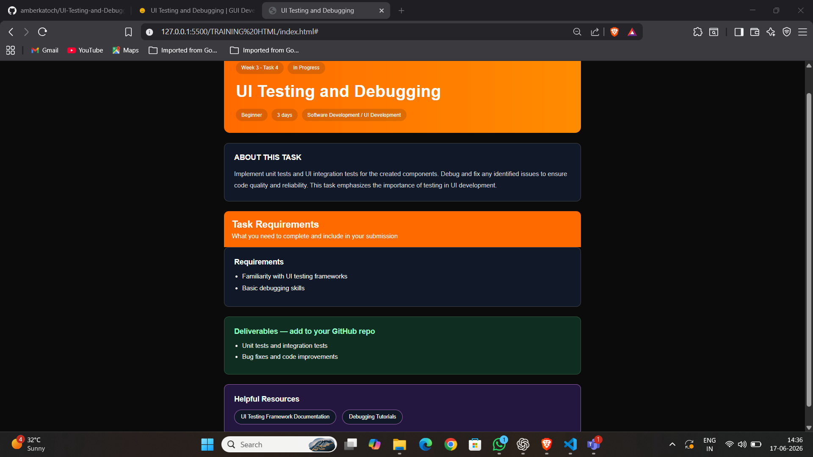

# UI Testing and Debugging

## Objective

Implement unit testing and integration testing for responsive UI components and fix identified issues.

## Features

- Responsive Design
- Unit Testing Documentation
- Integration Testing Documentation
- Bug Fix Reports
- Mobile, Tablet and Desktop Support

## Technologies Used

- HTML
- CSS
- JavaScript
## Screenshots

### Desktop View

### Mobile View

## Deliverables

- Unit Tests
- Integration Tests
- Bug Fixes
- Code Improvements
